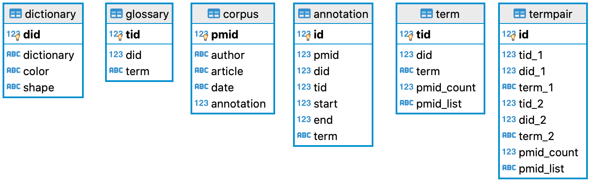
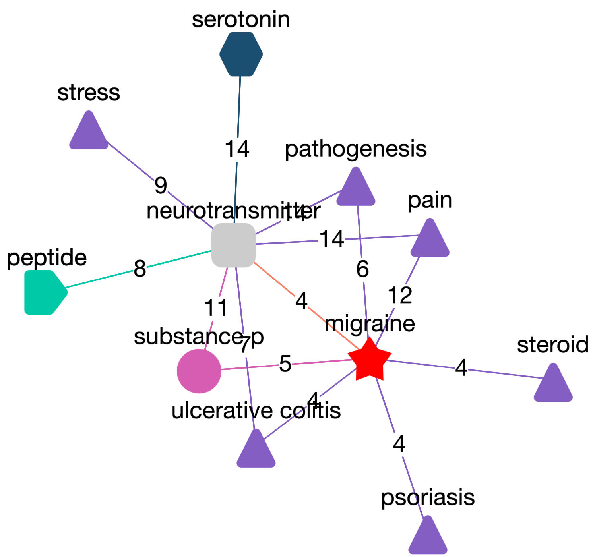

### OpenFusion / Text Mining Tool

**OpenFusion.py** is a text mining tool written in Python for creating **SQLite** biomedical databases on specific topic by using **PubMed** (https://pubmed.ncbi.nlm.nih.gov/) as a source. This database can be used locally or on the web.
<p align="center">

</p>

#### Python Requirements
Install or upgrade Biopython

        pip install biopython
        pip install --upgrade biopython

#### Using the program

All you need is `OpenFusion.py`. The rest is simple as 1, 2, 3:

1. Create files containing dictionary terms, e.g. genes.txt, diseases.txt, etc. Each line must contain a word or phrase, which can be followed by tab-separated synonyms, e.g.

       Alpers Disease       Progressive Cerebral Poliodystrophy
   <br>
2. Create a project file, e.g. `myProject.yml`. Simply use provided template for your porjects.
   <br>
3. Run:

       ./OpenFusion.py -p myProject.yml
   The program will create SQLite database as specified in the project file. In addition, it will create a file containing PubMed articles in MEDLINE format, so you don't have to download them again if you wish to recreate the database.

### Database
The SQLite database created by a program can be used for futher research, displayed on the web as tables or as graphs.

### Entity relations (ER) diagram
<p align="center">

</p>

Tables: 
- `dictionary`: list of dictionaries
   - `did`: dictionary id (primary key)
   - `dictionary`: dictionary name as specified in .yml file
   - `color`: color in which dictionary will be displayed (auto assigned)
   - `shape`: shape in which dictionary will be represented  (auto assigned)
- `glossary`: list of all dictionary terms
   - `tid`: term id (primary key)
   - `did`: dictionary id the term belongs to (foregin key)
   - `term`: tab separated term synonyms
- `corpus`: articles downloaded from PubMed
   - `pmid`: PubMed assigned id (primary key)
   - `author`: list of authors
   - `article`: article text - title and the abstract are delimited by the pilcrow sign (¶ i.e.`\u00B6`)
   - `date`: the article date in ISO format
   - `annotation`: article annotation in JSON format,each 
      ```jso
      [did, tid,start_term_postion,end_term_postion term_name]
      ```
      For example, the term "visual illusions" (dictionary 2, term 13) occupy positions from  8 to 23 and the term migraine" (did=2, tid=7) occupy positions from 54 to 61 in the article.
      ```json
      [
         [2, 13, 8, 23, "visual illusions"]
         [2, 7, 54, 61, "migraine"],
      ]
      ```
      This information is useful when highligting terms which can be displayed in diferent colors.
- `annotation`: contains pmid-tid pairs
   - `id`: table primary key
   - `pmid`: article id assigned by PubMed
   - `did`: dictionary id the term belongs to
   - `tid`: term id
   - `idx`: position of term within the arcticle
   - `term`: term name
- `term`: contains list of all terms found
   - `tid`: term id
   - `did`: dictionary id the term belongs to
   - `term`: term name
   - `pmid_count`: number of articles the term has been found in
   - `pmid_list`: comma separated list of articles containing the term.
   This table can be used to display various statistics or as a data source for machine learning programs.
- `termpair`: contains list of term co-occurences
   - `id`: table primary key
   - `tid_1`: term 1 id
   - `did_1`: dictionary id the term 1 belongs to
   - `term_1`: term 1 name
   - `tid_2`: term 2 id
   - `did_2`: dictionary id the term 2 belongs to
   - `term_2`: term 2name
   - `pmid_count`: number of articles terms has been found in
   - `pmid_list`: comma separated list of articles containing the terms.
   This table can be used to generate complex graphs showing links between terms (e.g. by using the cytoscape (https://js.cytoscape.org). For example, terms are represented as colored blocks (as defined in the `dictionary` table and the links between them denote number of articles linked terms co-occur)
<p align="center">

</p>

#### Example

Have a look at the example in the [Alice_in_Wonderland](Alice_in_Wonderland/README.md)  directory.


#### Web utilities
The directory [web_utils](web_utils/README.md) contains number of utilities written in Python and PHP that you can use to publish your database online. 


#### Citation
Get it here:  [](https://zenodo.org/badge/latestdoi/248162501)