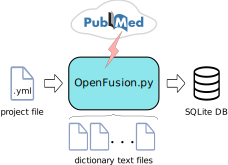

### OpenFusion / Text Analytics

**OpenFusion.py** is a text analytics tool written in Python for creating **SQLite** biomedical databases on specific topic by using **PubMed** (https://pubmed.ncbi.nlm.nih.gov/) as a source. This database file can be used locally or on the web.

#### Python Requirements
Install or upgrade Biopython

        pip install biopython
        pip install --upgrade biopython

#### Using the program

It is simple as 1, 2, 3:

1. Create files containing dictionary terms, e.g. genes.txt, diseases.txt, etc. Each line must contain a word or phrase, which can be followed by tab-separated synonyms, e.g.

       Alpers Disease       Progressive Cerebral Poliodystrophy
    
2. Create a project file, e.g. `myProject.yml`. Sinmply use provided template for your porjects.
    
3. Run:

       ./OpenFusion.py -p myProject.yml
   The program will create SQLite database specified in the project file. In addition, it will create a file containing PubMed articles in MEDLINE format, so you don't have to download them again if you wish to recreate the database.

#### Example

have a look at the example files in the [Alice_in_Wonderland](Alice_in_Wonderland/README.md)  directory.
    
#### Citation
Get it here:  