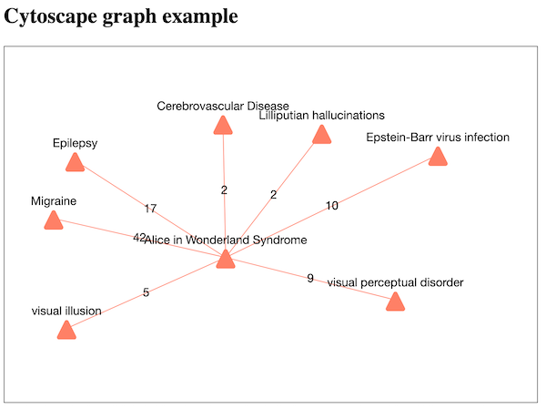

### Web utilities

This directory contains number of utilities written in Python and PHP that you can use to publish your database online. All you need is your database file created by the `OpenFusion.py` utility. Examples use the `aiwc.db` database you can create by running the project in `Alice_in_Wonderland` directory.

- `getArticle.py` and `getArticle.php` is the same utility that displays selected article on the web page. These utilities are called via GET or POST method by supplying the article pmid. As illustrated in file `pubmed-example.html`, you can make an asynchronous Ajax call as:

      getArticle.php?pmid=10767914 

  This utility gets the requested article from the database and highlihts the annotated terms as:
  ```html
  <span title="Disease" class="did-2" id="tid-4">Alice in Wonderland</span>
  ```
  where `did-2` is the dictionary number and `tid-4` is the term number in the database. Colors for each of the dictionaries are defined is `dictionaries.css` stylesheet file. By using jquery you can attach various events to dictionary classes and to term ids.

  - `getNodes.py` and `getNodes.php` is the same utility that displays selected article on the web page. These utilities are called via GET or POST method by supplying the staring node id. As illustrated in file `graph-example.html`, you can make an asynchronous Ajax call as:

        getNodes.py?id=1
<p align="center">

</p>
